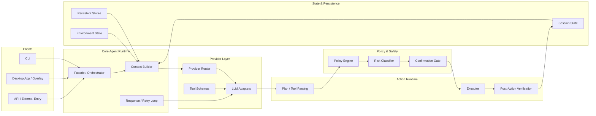
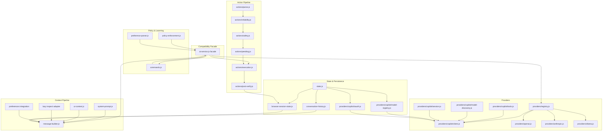

# Refactored AI Service Plan

## Purpose

This document defines the implementation plan for refactoring `src/main/ai-service.js` into a modular system without losing any existing functionality.

The current file must remain operational during the migration. New modules should be built alongside the existing implementation. No code should be removed from `src/main/ai-service.js` until feature parity is proven through tests, smoke checks, and runtime validation.

## Primary Goal

Refactor the current AI service from a monolithic runtime into a layered architecture that:

1. Preserves the current public API and runtime behavior.
2. Preserves all existing Electron, CLI, agent, UI-automation, safety, and provider features.
3. Supports iterative implementation with low-risk, reviewable change sets.
4. Enables eventual reuse of pure AI/runtime-neutral logic in a more package-oriented architecture.
5. Keeps `src/main/ai-service.js` as a live compatibility facade until the end.

## Hard Constraints

1. Do not remove code from `src/main/ai-service.js` during migration.
2. Do not change the external API surface consumed by the Electron app, CLI, tests, or agent system.
3. Preserve current persistence locations under `~/.liku-cli`.
4. Preserve optional Electron loading behavior so CLI-only execution still works.
5. Preserve lazy inspect-service loading to avoid circular/runtime breakage.
6. Preserve current IPC-facing and CLI-facing behavior even if internals move.
7. Preserve action safety, confirmation, rewrite, and post-verification behavior.
8. Preserve provider fallback, model handling, Copilot auth/session behavior, and message-building semantics.

## Current Reality

`src/main/ai-service.js` currently acts as all of the following at once:

- provider registry
- Copilot auth and session exchange runtime
- model registry and model preference persistence
- prompt builder
- UI context integrator
- live visual context manager
- browser continuity state store
- policy enforcement engine
- preference learning parser
- slash command router
- safety classifier
- action parser
- reliability rewrite engine
- execution orchestrator
- post-action verification/self-heal runtime
- public compatibility facade

That is the root problem. The file already contains the right layers conceptually, but they are compressed into one implementation unit.

## Migration Principle

The migration must be additive first, subtractive last.

Implementation sequence:

1. Create new internal modules.
2. Move logic behind stable wrappers.
3. Re-export through `src/main/ai-service.js`.
4. Prove parity after each phase.
5. Reduce `src/main/ai-service.js` to a thin composition facade only after all features are stable.
6. Remove legacy in-file implementations only after final parity is proven.

## Current Progress Snapshot

Completed extraction seams:

- `providers/copilot/tools.js`
- `policy-enforcement.js`
- `actions/parse.js`
- `ui-context.js`
- `conversation-history.js`
- `browser-session-state.js`
- `providers/copilot/model-registry.js`
- `providers/registry.js`
- `system-prompt.js`
- `message-builder.js`
- `preference-parser.js`
- `slash-command-helpers.js`
- `commands.js`
- `providers/orchestration.js`
- `visual-context.js`

Current facade responsibilities still living in `src/main/ai-service.js`:

- Copilot OAuth and session exchange
- concrete provider HTTP clients
- safety classification and pending-action lifecycle
- reliability rewrites
- action execution and resume-after-confirmation
- post-action verification and self-heal flows

Current proof points:

- `scripts/test-ai-service-contract.js`
- `scripts/test-ai-service-commands.js`
- `scripts/test-ai-service-provider-orchestration.js`
- `scripts/test-v006-features.js`
- `scripts/test-bug-fixes.js`

Important compatibility constraint:

- `src/main/ai-service.js` still contains literal markers preserved specifically for source-sensitive regression tests. Until those tests are hardened, keep the facade text stable while moving internals behind it.

## High-Level Architecture

### Industry Pattern



### Planned Liku Architecture



## Target Internal Module Tree

```text
src/main/ai-service.js
src/main/ai-service/
  state.js
  system-prompt.js
  ui-context.js
  message-builder.js
  conversation-history.js
  browser-session-state.js
  commands.js
  policy-enforcement.js
  preference-parser.js
  providers/
    registry.js
    openai.js
    anthropic.js
    ollama.js
    copilot/
      tools.js
      oauth.js
      session.js
      model-registry.js
      model-discovery.js
      client.js
  actions/
    parse.js
    safety.js
    pending.js
    reliability.js
    post-verify.js
    execution.js
```

## Public Compatibility Contract

The following exports must remain available from `src/main/ai-service.js` until the migration is complete:

- `setProvider`
- `setApiKey`
- `setCopilotModel`
- `getCopilotModels`
- `discoverCopilotModels`
- `getCurrentCopilotModel`
- `getModelMetadata`
- `addVisualContext`
- `getLatestVisualContext`
- `clearVisualContext`
- `sendMessage`
- `handleCommand`
- `getStatus`
- `startCopilotOAuth`
- `setOAuthCallback`
- `loadCopilotToken`
- `AI_PROVIDERS`
- `COPILOT_MODELS`
- `parseActions`
- `hasActions`
- `preflightActions`
- `parsePreferenceCorrection`
- `executeActions`
- `gridToPixels`
- `systemAutomation`
- `ActionRiskLevel`
- `analyzeActionSafety`
- `describeAction`
- `setPendingAction`
- `getPendingAction`
- `clearPendingAction`
- `confirmPendingAction`
- `rejectPendingAction`
- `resumeAfterConfirmation`
- `setUIWatcher`
- `getUIWatcher`
- `setSemanticDOMSnapshot`
- `clearSemanticDOMSnapshot`
- `LIKU_TOOLS`
- `toolCallsToActions`

## Feature Inventory That Must Survive

### Provider and Model Features

- GitHub Copilot provider support
- OpenAI provider support
- Anthropic provider support
- Ollama provider support
- provider fallback ordering
- Copilot model registry
- dynamic model discovery
- current model persistence
- model metadata reporting
- per-call model override handling where currently supported

### Authentication and Persistence Features

- Copilot OAuth device flow
- Copilot session token exchange
- token load/save
- token migration from legacy location
- conversation history load/save
- model preference load/save
- persistence under `~/.liku-cli`

### Prompt and Context Features

- system prompt generation
- platform-specific prompt content
- live UI state injection
- inspect mode context injection
- semantic DOM context injection
- browser continuity injection
- preference-based system steering
- visual screenshot context inclusion
- provider-specific vision payload formatting

### Tooling and Action Features

- tool-call schema for native function calling
- tool-call to action translation
- action parsing from model output
- action existence detection
- action format enforcement retry path
- deterministic rewrite of low-reliability action plans
- browser-specific non-visual strategies
- VS Code integrated browser support path

### Safety and Policy Features

- app-scoped action policies
- negative policy enforcement
- preferred action policy enforcement
- bounded regeneration after policy failure
- action safety classification
- user confirmation gating
- pending action lifecycle
- risky command handling

### Execution and Verification Features

- execution pipeline
- injected custom executor support
- screenshot callback support
- post-launch verification
- popup recipe follow-up
- self-heal retries
- browser continuity update after execution
- resume after confirmation

### CLI and Electron Features

- slash command handling
- `/model`, `/provider`, `/status`, `/login`, `/capture`, `/vision`, `/clear`
- optional Electron availability in CLI mode
- direct use by Electron main process
- direct use by CLI chat loop
- indirect use by agent adapter layers
- direct use of `aiService.systemAutomation`

## AI and Agent Features Outside ai-service.js That Are Affected

### Electron Main Process

The Electron app depends on `ai-service` behavior from `src/main/index.js` for:

- chat message handling
- command handling
- provider/key state changes
- auth callback wiring
- visual context storage
- action parsing
- action execution
- pending confirmation flow
- safety analysis
- model metadata access
- systemAutomation passthrough usage

### CLI Chat Runtime

The CLI depends on `ai-service` for:

- interactive chat message handling
- command routing
- action detection and execution
- model discovery and selection
- preference teaching flow
- UI watcher wiring
- prompt/image state handling

### Agent Framework

The internal agent framework expects an adapter layer that:

- can chat using an `aiService`-like backend
- exposes model metadata
- supports model-aware orchestration
- preserves structured agent/runtime traces

This means the modular plan should preserve space for a future agent-facing AI adapter layer separate from the user-facing automation loop.

## ultimate-ai-system Alignment

`ultimate-ai-system` matches the desired architecture shape but not current feature depth.

### What Aligns

- monorepo layout with shared core and frontends
- slash command orchestration
- workflow metadata and checkpointing
- ESM/TS modular packaging discipline

### What Does Not Exist There Yet

- provider clients
- Copilot auth/session runtime
- prompt/context pipeline
- desktop automation runtime
- UI watcher/inspect integration
- action safety and verification pipeline
- runtime persistence equivalent to `~/.liku-cli`

### Recommendation

Use `ultimate-ai-system` as a future destination architecture and reference model, not as the immediate runtime host.

Short-term approach:

1. Modularize inside the current repo first.
2. Keep `src/main/ai-service.js` operational.
3. Make extracted modules reusable.
4. Port pure modules into monorepo-style packages later if desired.

## State Ownership Plan

### `state.js`

Owns shared process-wide state and stable paths:

- `LIKU_HOME`
- `TOKEN_FILE`
- `HISTORY_FILE`
- `MODEL_PREF_FILE`
- shared mutable provider/auth/model state if needed centrally

### `conversation-history.js`

Owns:

- in-memory conversation history
- max history limits
- load/save behavior
- history trimming semantics

### `browser-session-state.js`

Owns:

- browser continuity state
- continuity updates
- continuity reset behavior

### `ui-context.js`

Owns:

- `uiWatcher`
- semantic DOM snapshot
- semantic DOM timestamps and limits
- semantic DOM rendering

### `providers/copilot/model-registry.js`

Owns:

- static Copilot models
- dynamic model discovery state
- current model selection
- model metadata
- model preference persistence

### `actions/pending.js`

Owns:

- pending confirmation state
- confirm/reject lifecycle
- action resumption handoff state

## Phase-by-Phase Implementation Checklist

### Phase 0: Freeze Behavior

Create:

- `refactored-ai-service.md`
- `scripts/test-ai-service-contract.js`

Do:

- capture export surface
- capture result shapes for `sendMessage`, `handleCommand`, and `getStatus`
- capture pending-action lifecycle behavior
- capture a few prompt/output snapshots where feasible

Gate:

- current tests still pass
- no production code changes

### Phase 1: Extract Tool Schema

Create:

- `src/main/ai-service/providers/copilot/tools.js`

Move:

- `LIKU_TOOLS`
- `toolCallsToActions`

Keep in facade:

- direct re-exports from `src/main/ai-service.js`

Gate:

- tool schema and mapping tests pass

### Phase 2: Extract Policy Enforcement

Create:

- `src/main/ai-service/policy-enforcement.js`

Move:

- coordinate-action detection
- click-like action detection
- negative policy checks
- action policy checks
- policy-violation system-message builders

Keep in facade:

- internal imports only

Gate:

- policy-regeneration paths behave the same

### Phase 3: Extract Action Parsing

Create:

- `src/main/ai-service/actions/parse.js`

Move:

- `parseActions`
- `hasActions`

Keep in facade:

- wrappers preserving current export names

Gate:

- action parsing still works in CLI and Electron

### Phase 4: Extract UI Context

Create:

- `src/main/ai-service/ui-context.js`

Move:

- `setUIWatcher`
- `getUIWatcher`
- semantic DOM state
- `setSemanticDOMSnapshot`
- `clearSemanticDOMSnapshot`
- `pruneSemanticTree`
- `getSemanticDOMContextText`

Keep in facade:

- `getInspectService`
- direct export names unchanged

Gate:

- UI watcher pipeline tests pass

### Phase 5: Extract Shared Paths and History

Create:

- `src/main/ai-service/state.js`
- `src/main/ai-service/conversation-history.js`

Move:

- path constants
- history state
- history load/save

Keep in facade:

- bootstrap behavior triggered on module load

Gate:

- persisted history behavior unchanged

### Phase 6: Extract Browser Session State

Create:

- `src/main/ai-service/browser-session-state.js`

Move:

- browser continuity state
- getter/update/reset functions

Keep in facade:

- later execution summary update helper until reliability phase

Gate:

- continuity text still injects correctly

### Phase 7: Extract Copilot Model Registry

Create:

- `src/main/ai-service/providers/copilot/model-registry.js`

Move:

- `COPILOT_MODELS`
- dynamic registry state
- model normalization and capability inference
- selection helpers
- current model state
- metadata refresh
- model preference load/save

Keep in facade:

- public re-exports
- compatibility around provider updates

Gate:

- `/model` behaviors still work
- metadata and current model remain correct

### Phase 8: Extract Provider Registry

Create:

- `src/main/ai-service/providers/registry.js`

Move:

- `AI_PROVIDERS`
- provider selection state
- API key state
- fallback order
- `setProvider`
- `setApiKey`

Keep in facade:

- public export names unchanged

Gate:

- provider state and `getStatus()` remain correct

### Phase 9: Extract Copilot Auth and Client

Create:

- `src/main/ai-service/providers/copilot/oauth.js`
- `src/main/ai-service/providers/copilot/session.js`
- `src/main/ai-service/providers/copilot/model-discovery.js`
- `src/main/ai-service/providers/copilot/client.js`

Move:

- token load/save
- OAuth device flow
- callback registration
- session exchange
- model discovery
- Copilot client request flow

Keep in facade:

- optional Electron `shell` shim
- `openExternal` injection into OAuth module
- export names unchanged

Gate:

- `/login`, token load, and model discovery still behave the same

### Phase 10: Extract Other Provider Clients

Create:

- `src/main/ai-service/providers/openai.js`
- `src/main/ai-service/providers/anthropic.js`
- `src/main/ai-service/providers/ollama.js`

Move:

- `callOpenAI`
- `callAnthropic`
- `callOllama`

Keep in facade:

- `sendMessage` orchestration still local

Gate:

- provider fallback and non-Copilot requests still behave the same

### Phase 11: Extract Prompt and Message Builder

Create:

- `src/main/ai-service/system-prompt.js`
- `src/main/ai-service/message-builder.js`

Move:

- platform prompt logic
- system prompt
- visual context buffer
- visual context getter/setter/reset
- `buildMessages`

Keep in facade:

- lazy inspect-service getter
- wrapper exports for visual context functions
- `sendMessage` still orchestrates

Gate:

- prompt markers and message assembly behavior remain stable

### Phase 12: Extract Preference Parser and Commands

Create:

- `src/main/ai-service/preference-parser.js`
- `src/main/ai-service/commands.js`

Move:

- JSON object extraction
- patch sanitization
- payload validation
- `parsePreferenceCorrection`
- `handleCommand`

Keep in facade:

- export names unchanged
- current sync/async-compatible command behavior preserved

Gate:

- CLI command flows still work

### Phase 13: Extract Safety and Pending State

Create:

- `src/main/ai-service/actions/safety.js`
- `src/main/ai-service/actions/pending.js`

Move:

- safety levels
- safety patterns
- safety analysis
- action description
- pending action state and lifecycle functions

Keep in facade:

- all current exports unchanged

Gate:

- risky actions still require confirmation
- pending-action flows still resume correctly

### Phase 14: Extract Reliability Rewrites

Create:

- `src/main/ai-service/actions/reliability.js`

Move:

- `preflightActions`
- action normalization
- browser/app/url inference helpers
- deterministic web strategies
- action rewrite orchestration
- execution-summary browser continuity update if it remains tightly coupled

Keep in facade:

- `preflightActions` export unchanged

Gate:

- rewrite fixtures remain deterministic

### Phase 15: Extract Post-Verification

Create:

- `src/main/ai-service/actions/post-verify.js`

Move:

- launch verification helpers
- process/title matching
- popup recipe library
- popup selection and execution helpers
- post-action verify/self-heal runtime

Keep in facade:

- internal import only unless helper exposure becomes necessary for tests

Gate:

- bounded retry and popup self-heal behavior remain stable

### Phase 16: Extract Execution Last

Create:

- `src/main/ai-service/actions/execution.js`

Move:

- `executeActions`
- `resumeAfterConfirmation`

Keep in facade:

- wrappers or re-exports with unchanged public names
- `systemAutomation` export unchanged

Gate:

- execution behavior is unchanged in CLI and Electron

### Final Phase: Reduce ai-service.js to Compatibility Facade

Create:

- `src/main/ai-service/index.js`

Do:

- build canonical implementation entrypoint inside `src/main/ai-service/index.js`
- make `src/main/ai-service.js` re-export `require('./ai-service/index')`
- preserve module-load bootstrap and lazy runtime seams

Only after all parity gates pass:

- remove obsolete in-file implementations from the legacy file

## Required Co-Move Groups

Do not split these across unrelated phases:

- Copilot model registry and preference persistence
- Copilot OAuth flow, callback state, and token persistence
- reliability rewrite cluster and related browser heuristics
- safety classifier and pending confirmation state
- popup recipe logic and post-verification helpers
- browser continuity state and execution-summary continuity updates where tightly coupled

## Temporary Compatibility Shim Rules

1. `src/main/ai-service.js` remains the only public entrypoint until final phase.
2. New modules may be imported by the facade, but no external caller should use them directly during migration.
3. Avoid duplicate singleton state across modules.
4. Do not export raw mutable provider or pending state by value.
5. Preserve `systemAutomation` passthrough exactly.
6. Preserve lazy inspect-service loading.
7. Preserve optional Electron `shell` fallback behavior.
8. Preserve module-load initialization semantics.

## Verification Strategy

### Existing Scripts To Reuse

- `scripts/test-tier2-tier3.js`
- `scripts/test-bug-fixes.js`
- `scripts/test-run-command.js`
- `scripts/test-integration.js`
- `scripts/test-ui-watcher-pipeline.js`
- `scripts/smoke-command-system.js`
- `scripts/smoke-chat-direct.js`
- `scripts/smoke-shortcuts.js`

### New Characterization Tests To Add

- `scripts/test-ai-service-contract.js`

This should validate:

- export presence
- `getStatus()` shape
- `handleCommand()` result shape
- `sendMessage()` result shape using stubs where possible
- pending action lifecycle shape
- continuity and prompt contract snapshots where practical

### Tests That Need To Be Hardened

Some current tests read literal strings directly from `src/main/ai-service.js`. Those should be converted over time to behavior-level tests, because structural extraction will otherwise cause false failures.

Most likely brittle files:

- `scripts/test-v006-features.js`
- `scripts/test-bug-fixes.js`
- `scripts/smoke-command-system.js`

## Risks

### High Risk

- duplicate singleton state during extraction
- changing the `module.exports` contract
- breaking lazy runtime seams
- silently dropping UI context or browser continuity state
- changing action confirmation behavior
- changing provider fallback ordering or auth flow semantics

### Medium Risk

- changing `handleCommand()` sync/async behavior
- changing status payload shape
- changing prompt wording in ways that affect current tests or behavior
- splitting reliability helpers too aggressively

### Low Risk

- extracting pure helpers
- extracting static tool schemas
- extracting static constants and formatting helpers

## Non-Goals For First Pass

- redesign `system-automation`
- rehost the full runtime directly inside `ultimate-ai-system`
- convert the current runtime to ESM/TypeScript immediately
- change user-facing provider names
- redesign CLI UX
- redesign IPC channel names

## Success Criteria

The refactor is complete when all of the following are true:

1. `src/main/ai-service.js` is a thin compatibility facade.
2. Internal responsibilities are split into focused modules.
3. Electron behavior is unchanged.
4. CLI behavior is unchanged.
5. Agent-adapter behavior remains intact.
6. Provider, auth, context, safety, execution, and verification features all pass parity gates.
7. Existing persistence and migration behavior is unchanged.
8. Runtime-only seams remain valid in CLI-only mode and Electron mode.
9. The repo has enough contract coverage to safely remove obsolete legacy implementations.

## Implementation Rule

Do not remove the old code first.

Build the new system beside it, delegate incrementally, verify continuously, and only reduce the legacy file when the new modules already cover every accounted-for feature.
